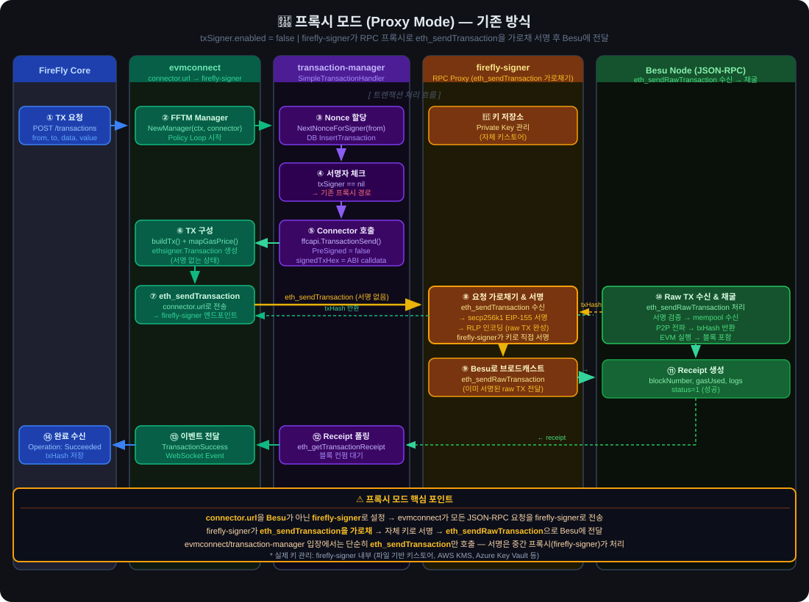
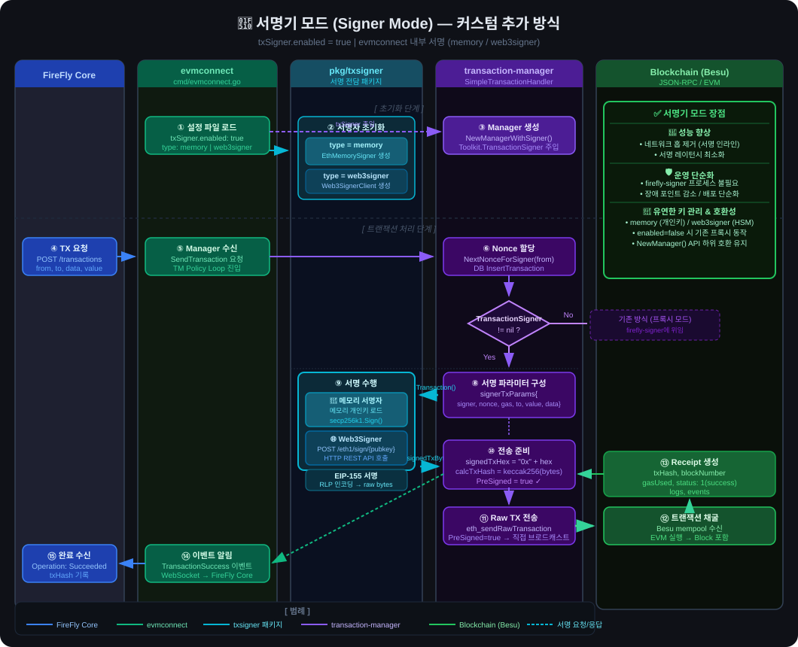

# 🔧 evmconnect & transaction-manager 커스텀 수정내역 정리

> **기준**: `upstream/main` (hyperledger/firefly-evmconnect, hyperledger/firefly-transaction-manager) 대비 커스텀 변경사항  
> **작성일**: 2026-08-19  
> **저장소**:  
> - evmconnect: `https://github.com/WebChainPros/evmconnect`  
> - transaction-manager: `https://github.com/WebChainPros/transaction-manager` (branch: `custom-1.5`)

---

## 🧩 전체 변경 목적

> **트랜잭션 서명(Signing)을 firefly-signer(외부 서비스)에 의존하지 않고,  
> evmconnect 내부 또는 Web3Signer를 통해 직접 처리할 수 있도록 커스텀 서명 모듈을 추가.**

---

## 📦 1. evmconnect 수정내역

### 커밋 목록 (upstream 대비)

| 커밋 해시 | 설명 |
|-----------|------|
| `1391015` | Commit custom 1.4 changes before 1.5 migration — 신규 txsigner 패키지 추가 |
| `ab3fb8b` | Merge custom 1.4 changes into 1.5.1 |
| `c27395a` | 서명전용추가 — import 네임스페이스를 `hyperledger` → `hyperledger-firefly`로 교체 |
| `7fb8869` | chore: set timezone to Asia/Seoul in evmconnect Dockerfile |
| `1d9950c` | feat: add GitHub Actions workflow and Dockerfile for multi-repo container builds |
| `c768325` | fix: run go mod tidy before make build in Dockerfile.custom |
| `1ca4075` | fix: tidy go.mod and go.sum for Docker build |
| `2158f70` | chore: replace local transaction-manager with remote fork URL |
| `515ac13` | fix(linter): fix gocyclo, gofmt, and deprecated ioutil issues |
| `742c49b` | fix(ci): convert docker image repository name to lowercase and set default tag |
| `56be612` | fix(config): register missing postgres histogram config description |
| `431a633` | chore: configure text auto-normalization in .gitattributes |

---

### 🆕 신규 파일

#### `pkg/txsigner/signer.go` — 메모리 기반 트랜잭션 서명자

**목적**: 개인키를 메모리에 로드하여 트랜잭션을 오프라인으로 직접 서명

**주요 구조/함수**:
```go
type EthMemorySigner struct {
    keyPairs  map[string]*secp256k1.KeyPair
    connector ffcapi.API
    chainID   int64
}

func NewEthMemorySigner(privateKeys []string, connector ffcapi.API) (*EthMemorySigner, error)
func (s *EthMemorySigner) SignTransaction(ctx context.Context, keyID string, txParamsJSON []byte) ([]byte, error)
```

**동작**:
1. 설정 파일의 `txSigner.privateKeys` 목록에서 개인키 로드
2. 주소(소문자 hex) → `secp256k1.KeyPair` 매핑 유지
3. `SignTransaction` 호출 시 EIP-155 트랜잭션 서명 후 RLP 인코딩된 raw tx 반환

---

#### `pkg/txsigner/web3signer.go` — Web3Signer 클라이언트

**목적**: Consensys Web3Signer REST API를 통한 외부 서명 처리

**주요 구조/함수**:
```go
type Web3SignerClient struct {
    web3signerURL string
    connector     ffcapi.API
    chainID       int64
    client        *http.Client
    pubKeyMap     map[string]string // address → pubkey 캐시
}

func NewWeb3SignerClient(web3signerURL string, connector ffcapi.API) (*Web3SignerClient, error)
func (s *Web3SignerClient) SignTransaction(ctx context.Context, keyID string, txParamsJSON []byte) ([]byte, error)
func (s *Web3SignerClient) refreshPubKeyMap(ctx context.Context) error
```

**동작**:
1. `GET /api/v1/eth1/publicKeys`로 등록된 키 목록 조회 및 address 캐싱
2. 서명 요청 시 `POST /api/v1/eth1/sign/{pubkey}` 호출
3. 서명 결과로 RLP 인코딩된 raw 트랜잭션 반환

---

### 수정 파일

#### `internal/ethereum/config.go` — 신규 설정 키 추가

```go
// 추가된 상수
ConfigTxSignerEnabled     = "txSigner.enabled"
ConfigTxSignerType        = "txSigner.type"        // "memory" | "web3signer"
ConfigTxSignerPrivateKeys = "txSigner.privateKeys"
ConfigWeb3SignerURL       = "txSigner.web3signer.url"
```

**기본값**:
- `txSigner.enabled` = `false`
- `txSigner.type` = `"memory"`

---

#### `cmd/evmconnect.go` — 서명자 초기화 및 Manager 연결

**변경 내용**: `fftm.NewManager()` → `fftm.NewManagerWithSigner()` 호출로 교체

```go
var txSigner signer.TransactionSigner
if connectorConfig.GetBool(ethereum.ConfigTxSignerEnabled) {
    signerType := connectorConfig.GetString(ethereum.ConfigTxSignerType)
    if signerType == "web3signer" {
        // Web3Signer 클라이언트 초기화
        txSigner, err = txsigner.NewWeb3SignerClient(web3signerURL, c)
    } else {
        // 메모리 서명자 초기화
        pks := connectorConfig.GetStringSlice(ethereum.ConfigTxSignerPrivateKeys)
        txSigner, err = txsigner.NewEthMemorySigner(pks, c)
    }
}
m, err := fftm.NewManagerWithSigner(ctx, c, txSigner)
```

---

#### `internal/msgs/en_config_descriptions.go` — 설정 설명 추가

신규 txSigner 설정 항목 4개에 대한 영문 설명 등록

---

#### `evmconnect_config.yml`, `evmconnect_local_config.yml` — 설정 예시 추가

txSigner 섹션 예시 설정 추가

---

#### `config.md` — 문서 업데이트

신규 txSigner 설정 항목 9개 문서화

---

### Import 네임스페이스 변경 (`c27395a`)

| 변경 전 | 변경 후 |
|---------|---------|
| `github.com/hyperledger/firefly-common/...` | `github.com/hyperledger-firefly/common/...` |
| `github.com/hyperledger/firefly-signer/...` | `github.com/hyperledger-firefly/signer/...` |
| `github.com/hyperledger/firefly-transaction-manager/...` | `github.com/hyperledger-firefly/transaction-manager/...` |

---

## 📦 2. transaction-manager 수정내역

### 커스텀 브랜치: `custom-1.5`

| 커밋 해시 | 설명 |
|-----------|------|
| `e383f4c` | Commit custom 1.4 changes before 1.5 migration |
| `3483548` | Merge custom 1.4 changes into 1.5.1 |
| `baa621b` | Fix import namespaces in custom files to match 1.5 |
| `1324a2f` | 서명전용추가 — go.mod의 signer 의존성 네임스페이스 변경 |

> **현재 main 브랜치** (upstream 대비)는 linter/gitattributes 설정 변경만 포함 (`.golangci.yml`, `.gitattributes`)

---

### 🆕 신규 파일

#### `pkg/signer/interface.go` — 서명자 인터페이스 정의

```go
package signer

// TransactionSigner defines the interface for offline/external transaction signing.
// This allows the transaction manager to remain chain-agnostic.
type TransactionSigner interface {
    SignTransaction(ctx context.Context, keyID string, txParamsJSON []byte) (signedTx []byte, err error)
}
```

**목적**: TM이 체인 종류에 무관하게 외부 서명자를 주입받을 수 있는 인터페이스 정의

---

### 수정 파일

#### `pkg/txhandler/txhandler.go` — Toolkit에 TransactionSigner 필드 추가

```go
type Toolkit struct {
    // ... 기존 필드 ...
    
    // TransactionSigner toolkit contains methods to sign blockchain transactions offline/externally
    TransactionSigner signer.TransactionSigner  // ← 신규 추가
}
```

---

#### `pkg/fftm/manager.go` — NewManagerWithSigner() 함수 추가

```go
func NewManagerWithSigner(ctx context.Context, connector ffcapi.API, txSigner signer.TransactionSigner) (Manager, error) {
    m := newManager(ctx, connector)
    m.toolkit.TransactionSigner = txSigner  // 서명자 주입
    if err = m.initPersistence(ctx); err != nil { ... }
    if err = m.initServices(ctx); err != nil { ... }
    return m, nil
}
```

**기존 `NewManager()`는 유지** — 하위 호환성 보장

---

#### `pkg/txhandler/simple/simple_transaction_handler.go` — 트랜잭션 서명 로직 추가

**핵심 변경**: 트랜잭션 전송 직전에 `TransactionSigner`가 주입된 경우 오프라인 서명 수행

```go
// TransactionSigner가 있는 경우 오프라인/외부 서명 수행
if sth.toolkit.TransactionSigner != nil {
    txParams := &signerTxParams{
        Signer: mtx.TransactionHeaders.From,
        // ... nonce, gas, to, value, data ...
    }
    signedTxBytes, err := sth.toolkit.TransactionSigner.SignTransaction(ctx, mtx.TransactionHeaders.From, txParamsJSON)
    signedTxHex = "0x" + hex.EncodeToString(signedTxBytes)
    calcTxHash = "0x" + hex.EncodeToString(keccak256(signedTxBytes))
}

// 서명된 트랜잭션을 raw tx로 전송
sendTX.TransactionData = signedTxHex
if sth.toolkit.TransactionSigner != nil {
    sendTX.PreSigned = true  // Pre-signed 플래그 설정
}
```

**추가 처리**: `PreSigned = true` 시, 이미 알려진 트랜잭션/nonce too low 에러에서 calcTxHash로 해시 복구

---

## 🏗️ 아키텍처 변경 요약

두 가지 동작 모드의 전체 트랜잭션 처리 흐름을 레인 다이어그램으로 표현합니다.

### 📌 모드 비교 요약

| 항목 | 프록시 모드 (기존) | 서명기 모드 (커스텀) |
|------|-------------------|---------------------|
| `txSigner.enabled` | `false` | `true` |
| 서명 주체 | 외부 firefly-signer 서비스 | evmconnect 내부 (memory / web3signer) |
| 서명 방식 | HTTP 위임 (네트워크 홉) | 인라인 서명 (직접 처리) |
| 별도 프로세스 | firefly-signer 필요 | 불필요 |
| Manager 생성 | `NewManager()` | `NewManagerWithSigner()` |
| 하위 호환 | ✅ | ✅ |

---

### 🔀 프록시 모드 — 기존 방식 (`txSigner.enabled = false`)

> firefly-signer 외부 서비스에 서명을 위임하는 기존 구조



**처리 순서 요약**:
1. **FireFly Core** → `POST /api/v1/transactions` 요청
2. **evmconnect** `FFTM Manager` 수신 → transaction-manager Policy Loop 시작
3. **SimpleTransactionHandler**: `txSigner == nil` 확인 → 기존 프록시 경로 진입
4. **Nonce 할당**: `NextNonceForSigner(from)` → DB `InsertTransaction`
5. **Connector 호출**: `ffcapi.TransactionSend()` → evmconnect `TransactionSend()` 구현체 호출 (`PreSigned=false`)
6. **TX 구성**: `buildTx()` + `mapGasPrice()` → `ethsigner.Transaction` 구성 **(서명 없음)**
7. **`eth_sendTransaction` 전송**: 서명되지 않은 TX를 `connector.url`로 전달 → **firefly-signer RPC 프록시** 엔드포인트
8. **firefly-signer 가로채기 & 서명**: `eth_sendTransaction` 요청을 가로채 → 자체 관리 키로 `secp256k1` EIP-155 서명 → RLP 인코딩 → raw TX 완성
9. **firefly-signer → Besu**: 서명된 raw TX를 `eth_sendRawTransaction`으로 Besu에 전달 → `txHash` 반환
10. **블록 채굴**: Besu가 mempool 수신 → P2P 전파 → EVM 실행 → 블록 포함 → Receipt 생성
11. **Receipt 폴링**: TM이 `eth_getTransactionReceipt`로 컨펌 대기
12. **이벤트**: `TransactionSuccess` → FireFly Core WebSocket 알림

> ⚠️ **핵심**: `connector.url`을 **Besu가 아닌 firefly-signer**로 설정하는 것이 핵심. evmconnect/TM은 `eth_sendTransaction`만 호출하고, 서명과 Besu 전달은 **중간 프록시인 firefly-signer**가 처리함.

---

### 🔐 서명기 모드 — 커스텀 추가 방식 (`txSigner.enabled = true`)

> evmconnect 내부에서 직접 서명 처리 (메모리 키 또는 Web3Signer)



**처리 순서 요약**:

**[초기화 단계]**
1. 설정 파일에서 `txSigner.enabled: true`, `type` 로드
2. `type=memory` → `EthMemorySigner` 생성 (개인키 메모리 로드)
   `type=web3signer` → `Web3SignerClient` 생성 (REST API 클라이언트)
3. `NewManagerWithSigner(ctx, connector, txSigner)` → `Toolkit.TransactionSigner` 주입

**[트랜잭션 처리 단계]**

4. **FireFly Core** → `POST /api/v1/transactions` 요청
5. **evmconnect Manager** 수신 → `SimpleTransactionHandler` Policy Loop 진입
6. **Nonce 할당**: `NextNonceForSigner(from)` → DB `InsertTransaction`
7. **분기 판단**: `Toolkit.TransactionSigner != nil` → 서명기 모드 경로 진입
8. **서명 파라미터 구성**: `signerTxParams{signer, nonce, gas, to, value, data}` JSON 직렬화
9. **서명 수행** (`pkg/txsigner`):
   - `memory`: 메모리에서 `secp256k1.KeyPair` 로드 → EIP-155 서명
   - `web3signer`: `POST /api/v1/eth1/sign/{pubkey}` HTTP 호출
   - 결과: RLP 인코딩된 raw bytes 반환
10. **전송 준비**: `signedTxHex`, `calcTxHash = keccak256(bytes)`, **`PreSigned = true`** 설정
11. **Raw TX 전송**: `eth_sendRawTransaction` → Besu로 직접 브로드캐스트
12. **Besu**: mempool 수신 → EVM 실행 → 블록 포함 → Receipt 생성
13. **이벤트**: `TransactionSuccess` → `WebSocket` → FireFly Core 알림

---

## ⚙️ 설정 방법

### `evmconnect_config.yml` 예시

```yaml
# 메모리 서명 모드 (개인키 직접 설정)
txSigner:
  enabled: true
  type: memory
  privateKeys:
    - "0xabcdef1234..."

# Web3Signer 모드
txSigner:
  enabled: true
  type: web3signer
  web3signer:
    url: "http://web3signer:9000"
```

---

## 📁 주요 수정 파일 목록

### evmconnect
| 파일 | 변경 유형 | 설명 |
|------|-----------|------|
| `pkg/txsigner/signer.go` | 🆕 신규 | 메모리 기반 트랜잭션 서명자 |
| `pkg/txsigner/signer_test.go` | 🆕 신규 | signer.go 단위 테스트 |
| `pkg/txsigner/web3signer.go` | 🆕 신규 | Web3Signer REST API 클라이언트 |
| `pkg/txsigner/web3signer_test.go` | 🆕 신규 | web3signer.go 단위 테스트 |
| `cmd/evmconnect.go` | ✏️ 수정 | 서명자 초기화 및 Manager 연결 |
| `internal/ethereum/config.go` | ✏️ 수정 | txSigner 설정 키 추가 |
| `internal/msgs/en_config_descriptions.go` | ✏️ 수정 | 설정 설명 추가 |
| `evmconnect_config.yml` | ✏️ 수정 | txSigner 설정 예시 추가 |
| `evmconnect_local_config.yml` | ✏️ 수정 | 로컬 개발용 설정 추가 |
| `config.md` | ✏️ 수정 | 설정 문서 업데이트 |

### transaction-manager
| 파일 | 변경 유형 | 설명 |
|------|-----------|------|
| `pkg/signer/interface.go` | 🆕 신규 | TransactionSigner 인터페이스 |
| `pkg/fftm/manager.go` | ✏️ 수정 | NewManagerWithSigner() 추가 |
| `pkg/txhandler/txhandler.go` | ✏️ 수정 | Toolkit에 TransactionSigner 필드 추가 |
| `pkg/txhandler/simple/simple_transaction_handler.go` | ✏️ 수정 | 오프라인 서명 로직 통합 |
| `pkg/txhandler/simple/simple_transaction_handler_test.go` | ✏️ 수정 | 신규 로직 테스트 추가 |
