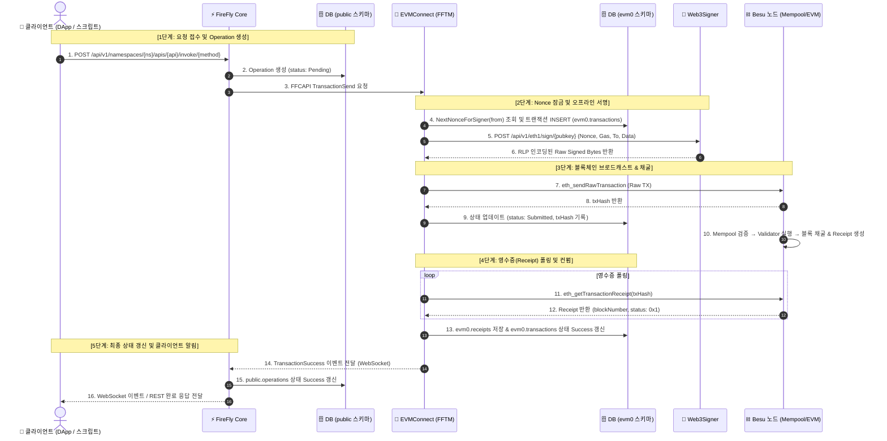

# 🚀 FireFly 엔드-투-엔드 트랜잭션 프로세스 흐름도

> **대상 아키텍처**: FireFly Core + EVMConnect + Web3Signer + Hyperledger Besu + PostgreSQL  
> **작성일**: 2026-08-20  
> **관련 모듈**: `firefly`, `evmconnect`, `web3signer`, `transaction-manager`

---

## 📌 1. 전체 아키텍처 및 컴포넌트 역할

| 컴포넌트 | 네임스페이스 / 포트 | 주요 역할 |
| :--- | :--- | :--- |
| **Client / DApp** | `highLoadTest.ts` 등 | REST API / WebSocket을 통해 트랜잭션 요청 및 완료 이벤트 수신 |
| **FireFly Core** | `firefly:5000` | FFI 인터페이스 검증, 비즈니스 Operation 생성, 이벤트 디스패치 |
| **PostgreSQL** | `firefly-postgres:5432` | • `public` 스키마: Core 비즈니스 데이터 및 Operation 관리 • `evm0` 스키마: EVMConnect의 Nonce, TX, 영수증(Receipt) 관리 |
| **EVMConnect** | `firefly-evmconnect:5000` | FFTM(FireFly Transaction Manager) 기반 Nonce 잠금, 정책 루프, 가스 산정 |
| **Web3Signer** | `firefly-evmconnect-web3signer:9000` | 키스토어 기반 `secp256k1` EIP-155 / EIP-1559 오프라인 서명 수행 |
| **Besu (Node)** | `rpcnode:8545` | Mempool 트랜잭션 수신, EVM 실행, 검증자 P2P 전파 및 블록 채굴 |

---

## 🗺️ 2. 트랜잭션 시퀀스 다이어그램 (Sequence Diagram)

---

## 🔍 3. 단계별 상세 처리 프로세스

### 1단계: 요청 접수 및 초기 기록 (FireFly Core)
1. **요청 수신**: 클라이언트(예: `highLoadTest.ts`)가 FireFly Core REST API로 트랜잭션 실행 요청을 전송합니다.
2. **파라미터 및 인터페이스 검증**: Core는 사전에 등록된 FFI(Contract Interface)와 요청 파라미터 타입을 검증합니다.
3. **Operation 레코드 생성**:
   * 작업 추적을 위한 고유 UUID의 `Operation`을 생성합니다.
   * PostgreSQL의 **`public.operations`** 테이블에 `type: blockchain_invoke`, `status: Pending` 상태로 즉시 저장합니다.
4. **Connector 디스패치**: 네임스페이스 설정에 매핑된 블록체인 커넥터(EVMConnect)로 `FFCAPI` 프로토콜을 통해 요청을 전달합니다.

---

### 2단계: Nonce 할당 및 오프라인 서명 (EVMConnect & Web3Signer)
5. **트랜잭션 큐잉 및 Nonce 잠금**:
   * EVMConnect의 **FFTM(FireFly Transaction Manager)** 정책 루프가 시작됩니다.
   * `from` 주소의 현재 논스를 DB(**`evm0.transactions`**)에서 확인하고, 순차적인 다음 Nonce를 안전하게 잠금(Lock) 및 할당합니다.
6. **가스 및 트랜잭션 페이로드 구성**:
   * 고정 가스 정책 또는 노드 조회를 통해 `gasLimit`, `gasPrice`(또는 EIP-1559 수수료)를 산정합니다.
   * `to`, `value`, `data`, `nonce`, `gas` 정보를 포함한 `signerTxParams`를 생성합니다.
7. **Web3Signer 외부 서명 호출**:
   * EVMConnect 내부의 `Web3SignerClient`가 Web3Signer의 엔드포인트(`POST /api/v1/eth1/sign/{pubkey}`)를 호출합니다.
   * Web3Signer는 보관 중인 키스토어/개인키로 `secp256k1` EIP-155 서명을 수행하고, 서명된 **RLP Raw Bytes**를 응답합니다.

---

### 3단계: 블록체인 브로드캐스트 & 채굴 (Besu)
8. **Raw TX 전송**: EVMConnect가 서명된 바이트열을 Besu RPC 노드로 **`eth_sendRawTransaction`**을 호출하여 직접 브로드캐스트합니다.
9. **트랜잭션 해시 수신**:
   * Besu로부터 `txHash`를 수신하고, **`evm0.transactions`**의 상태를 `Submitted`로 변경합니다.
10. **블록 포함 (Mining)**:
    * Besu 노드의 Mempool(TxPool)에 등록된 트랜잭션이 검증자 노드들에 의해 블록체인 상태 머신에서 실행됩니다.
    * 블록에 포함되고 트랜잭션 영수증(Receipt)이 생성됩니다.

---

### 4단계: 영수증(Receipt) 확인 및 컨펌 대기 (EVMConnect)
11. **Receipt 폴링**: EVMConnect의 백그라운드 워커가 `eth_getTransactionReceipt`를 주기적으로 호출하여 채굴 완료 여부를 확인합니다.
12. **컨펌 요건 검증**: 설정된 컨펌 수(`confirmations.required = 0`)를 만족하고 `status == 0x1 (성공)`임을 확인합니다.
13. **EVMConnect DB 갱신**:
    * **`evm0.receipts`** 테이블에 블록 번호, 사용된 가스, 이벤트 로그 등 영수증 상세를 기록합니다.
    * **`evm0.transactions`** 테이블의 상태를 `Success`로 최종 갱신합니다.

---

### 5단계: 최종 상태 업데이트 및 클라이언트 통보 (Core → Client)
14. **Core 알림 (WebSocket)**: EVMConnect가 FireFly Core로 `TransactionSuccess` 이벤트를 WebSocket을 통해 발행합니다.
15. **Core DB 갱신**: FireFly Core는 **`public.operations`**의 상태를 `Success`로 업데이트합니다.
16. **클라이언트 수신**: 클라이언트(DApp / 스크립트)가 대기 중이던 WebSocket 구독이나 동기식 REST 응답을 통해 최종 트랜잭션 성공을 전달받습니다.

---

## 📊 4. PostgreSQL 데이터베이스 상태 변화표

| 처리 단계 | `public.operations` (Core) | `evm0.transactions` (EVMConnect) | `evm0.receipts` (EVMConnect) |
| :--- | :--- | :--- | :--- |
| **1. 요청 접수** | `Pending` (작업 생성) | *(레코드 없음)* | *(레코드 없음)* |
| **2. Nonce 할당 & 서명** | `Pending` | `Pending` (Nonce 할당됨) | *(레코드 없음)* |
| **3. Besu 전송** | `Pending` | `Submitted` (txHash 저장) | *(레코드 없음)* |
| **4. 채굴 및 컨펌** | `Pending` | **`Success`** | **영수증 레코드 생성** |
| **5. Core 통보 완료** | **`Success`** | **`Success`** | **영수증 보관 완료** |

---

## 🛡️ 5. 주요 장애 대응 및 안정성 보장 메커니즘
1. **멱등성 및 Nonce 관리**:
   * 여러 스레드/요청이 동시에 들어와도 `evm0.transactions` 테이블의 논스 락을 통해 Nonce 충돌이나 갭(Gap) 없이 순차 전송이 보장됩니다.
2. **트랜잭션 재시도 (Policy Engine)**:
   * 가스비 부족 또는 일시적 네트워크 오류 발생 시 FFTM의 Transaction Handler 정책에 따라 지정된 횟수(`operations.retry.maxAttempts`)만큼 자동 재시도합니다.
3. **영속성 보장**:
   * Pod가 예기치 않게 재시작되더라도 모든 진행 상태가 PostgreSQL(`public` 및 `evm0`)에 보관되어 있으므로, 재기동 즉시 미완료 트랜잭션을 복구하여 처리를 이어갑니다.
